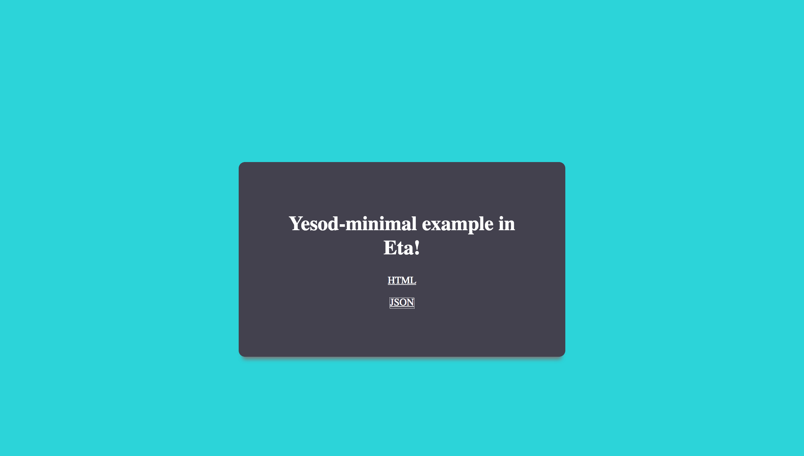

<h1 align="center">Yesod-minimal example in Eta</h1>

<p align="center">
  
</p>

## Running the server

1) Fire up the terminal and enter the commands:

  ```
  $ git clone https://github.com/Jyothsnasrinivas/eta-yesod-minimal.git
  $ cd eta-yesod-minimal
  $ etlas run
  ```

2) Open the url `http://localhost:3000` in your favourite browser.
